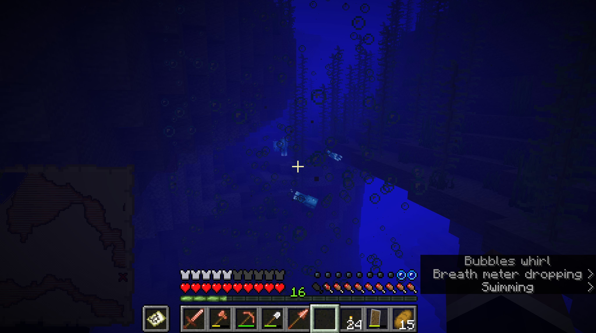
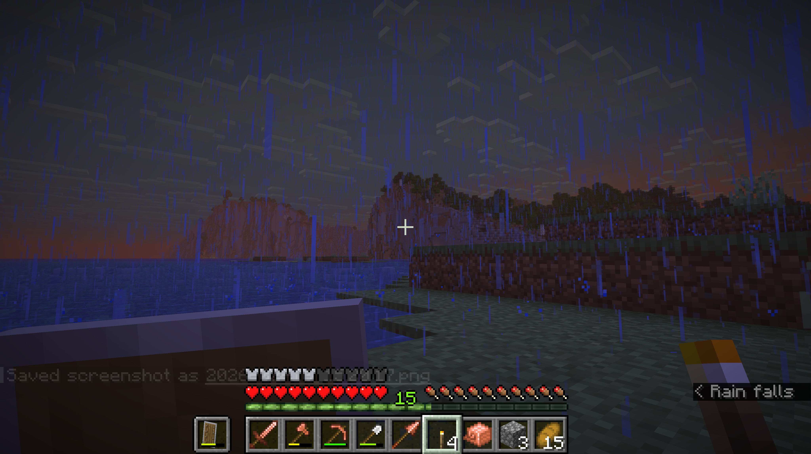
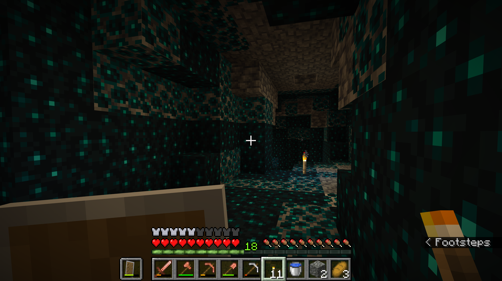
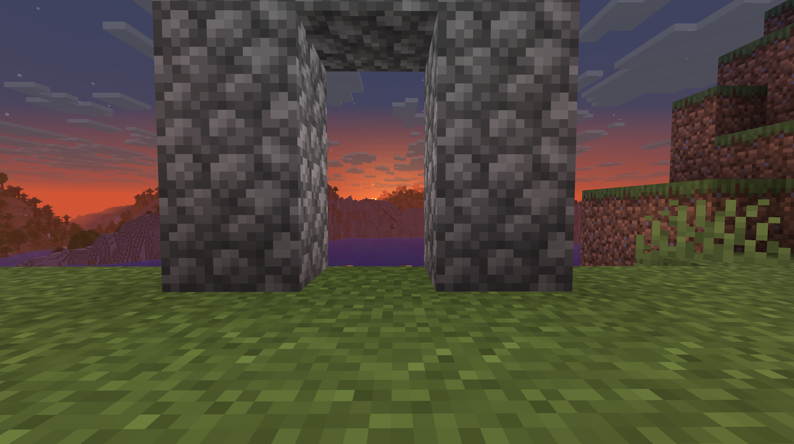

>
>
>Date (YYYY-MM-DD): 2026-02-17
>
>Time (HH.MM.SS): 16.03.13
>
>Notes: Cow farm! Small for now, just wait till they start multiplying!

>
>
>Date (YYYY-MM-DD): 2026-02-16
>
>Time (HH.MM.SS): 15.34.21
>
>Notes: ITS ON A HORSE! THE ZOMBIE IS ON A FRICKIN ZOMBIE HORSE!!

>
>
>Date (YYYY-MM-DD): 2026-02-16
>
>Time (HH.MM.SS): 15.32.54
>
>Notes: Second cow acquired!

>
>
>Date (YYYY-MM-DD): 2026-02-16
>
>Time (HH.MM.SS): 15.27.55
>
>Notes: Cliff-side needs some transformation.

>
>
>Date (YYYY-MM-DD): 2026-02-16
>
>Time (HH.MM.SS): 15.26.26
>
>Notes: Couple of glow squids. Looks calming, yet ominous.

>
>
>Date (YYYY-MM-DD): 2026-02-16
>
>Time (HH.MM.SS): 15.25.38
>
>Notes: Wow! Haven't seen one of those yet! It's called a Nautilus (I think...)

>
>
>Date (YYYY-MM-DD): 2026-02-16
>
>Time (HH.MM.SS): 15.20.59
>
>Notes: Wallpaper worthy!

>
>
>Date (YYYY-MM-DD): 2026-02-16
>
>Time (HH.MM.SS): 15.20.27
>
>Notes: Look at that horizon! (2)

>
>
>Date (YYYY-MM-DD): 2026-02-16
>
>Time (HH.MM.SS): 15.20.17
>
>Notes: Look at that horizon!

>
>
>Date (YYYY-MM-DD): 2026-02-15
>
>Time (HH.MM.SS): 14.52.09
>
>Notes: Almost got myself a stack of wheat with this puppy!

>
>
>Date (YYYY-MM-DD): 2026-02-15
>
>Time (HH.MM.SS): 14.41.20
>
>Notes: Foreshadowing for the places to come the deeper I go.

>
>
>Date (YYYY-MM-DD): 2026-02-15
>
>Time (HH.MM.SS): 14.26.06
>
>Notes: Small gate I built to enter my cliff-side base (which is still under-construction).

>
>
>Date (YYYY-MM-DD): 2026-02-15
>
>Time (HH.MM.SS): 14.25.44
>
>Notes: Reminds me of Aneesha... I miss her...

>
>
>Date (YYYY-MM-DD): 2026-02-15
>
>Time (HH.MM.SS): 14.15.10
>
>Notes: LOCKED FOREVER! HAHAHAHAHA!!

>
>
>Date (YYYY-MM-DD): 2026-02-15
>
>Time (HH.MM.SS): 14.05.05
>
>Notes: Gotta feed them to gain their trust!

>
>
>Date (YYYY-MM-DD): 2026-02-14
>
>Time (HH.MM.SS): 23.44.17
>
>Notes: I'll be right back my little pup. Have some premium mutton while you are at it!

>
>
>Date (YYYY-MM-DD): 2026-02-14
>
>Time (HH.MM.SS): 23.38.37
>
>Notes: Dry Hands is my go-to track to cry to... Aneesha still hasn't called me... It's valentines day... How much will I be able to distract myself with this game?

>
>
>Date (YYYY-MM-DD): 2026-02-14
>
>Time (HH.MM.SS): 23.30.15
>
>Notes: That diamond in a sus position rn... Should I mine it?

>
>
>Date (YYYY-MM-DD): 2026-02-14
>
>Time (HH.MM.SS): 23.26.54
>
>Notes: Adopting all these poor souls I could find.

>
>
>Date (YYYY-MM-DD): 2026-02-14
>
>Time (HH.MM.SS): 23.23.56
>
>Notes: Is this where the souls go after mobs die?

>
>
>Date (YYYY-MM-DD): 2026-02-14
>
>Time (HH.MM.SS): 23.23.43
>
>Notes: Tower of lava. Looks ominous...

>
>
>Date (YYYY-MM-DD): 2026-02-14
>
>Time (HH.MM.SS): 23.23.23
>
>Notes: Coordinates to my nether portal.

>
>
>Date (YYYY-MM-DD): 2026-02-14
>
>Time (HH.MM.SS): 23.23.12
>
>Notes: Secured the portal! Diving in!

>
>
>Date (YYYY-MM-DD): 2026-02-14
>
>Time (HH.MM.SS): 23.14.18
>
>Notes: Reminds me of Chica... When she used to run under my bed so my mom won't find her. Those were the good old days... She'll never come back, but I'll never forget my little pup.

>
>
>Date (YYYY-MM-DD): 2026-02-14
>
>Time (HH.MM.SS): 23.13.20
>
>Notes: My loyal companion! (other than Aneesha ofc)

>
>
>Date (YYYY-MM-DD): 2026-02-14
>
>Time (HH.MM.SS): 23.05.39
>
>Notes: Portal is now lit!

>
>
>Date (YYYY-MM-DD): 2026-02-14
>
>Time (HH.MM.SS): 19.36.58
>
>Notes: Beautiful snow... I miss her a lot...

>
>
>Date (YYYY-MM-DD): 2026-02-14
>
>Time (HH.MM.SS): 15.03.25
>
>Notes: Light leaving the edge of the world *Some might say horizon, but we all know the Earth is flat!*

>
>
>Date (YYYY-MM-DD): 2026-02-14
>
>Time (HH.MM.SS): 15.03.13
>
>Notes: A lone flower on the side of a cliff. No bees here to pollinate off of it. Almost reminds me of myself. Sad. Alone. Still going on somehow.

>
>
>Date (YYYY-MM-DD): 2026-02-14
>
>Time (HH.MM.SS): 15.02.35
>
>Notes: Beautiful sunset behind my portal.

>
>
>Date (YYYY-MM-DD): 2026-02-14
>
>Time (HH.MM.SS): 15.01.10
>
>Notes: Reminded me of the good 'ol days... But it wasn't by C418?!

>
>
>Date (YYYY-MM-DD): 2026-02-14
>
>Time (HH.MM.SS): 15.00.53
>
>Notes: Nether time!...or enchanting table time?

>
>
>Date (YYYY-MM-DD): 2026-02-14
>
>Time (HH.MM.SS): 15.00.49
>
>Notes: I'm mining with my sparkling pick yo!

>
>
>Date (YYYY-MM-DD): 2026-02-08
>
>Time (HH.MM.SS): 16.58.30
>
>Notes: DIAMONDS!...diamond?

>
>
>Date (YYYY-MM-DD): 2026-02-08
>
>Time (HH.MM.SS): 16.58.27
>
>Notes: The coordinates of my first ever diamond ore.

>
>
>Date (YYYY-MM-DD): 2026-02-06
>
>Time (HH.MM.SS): 14.52.57
>
>Notes: A looping cliff-side cave I found. Might build a base here.

>
>
>Date (YYYY-MM-DD): 2026-02-06
>
>Time (HH.MM.SS): 14.48.02
>
>Notes: Coordinates to a small cliff-water type cave I found. (IDK how to explain it properly.)

>
>
>Date (YYYY-MM-DD): 2026-02-05
>
>Time (HH.MM.SS): 16.21.28
>
>Notes: I'd never seen an underwater cave that touched the surface before. This was kinda cool.

